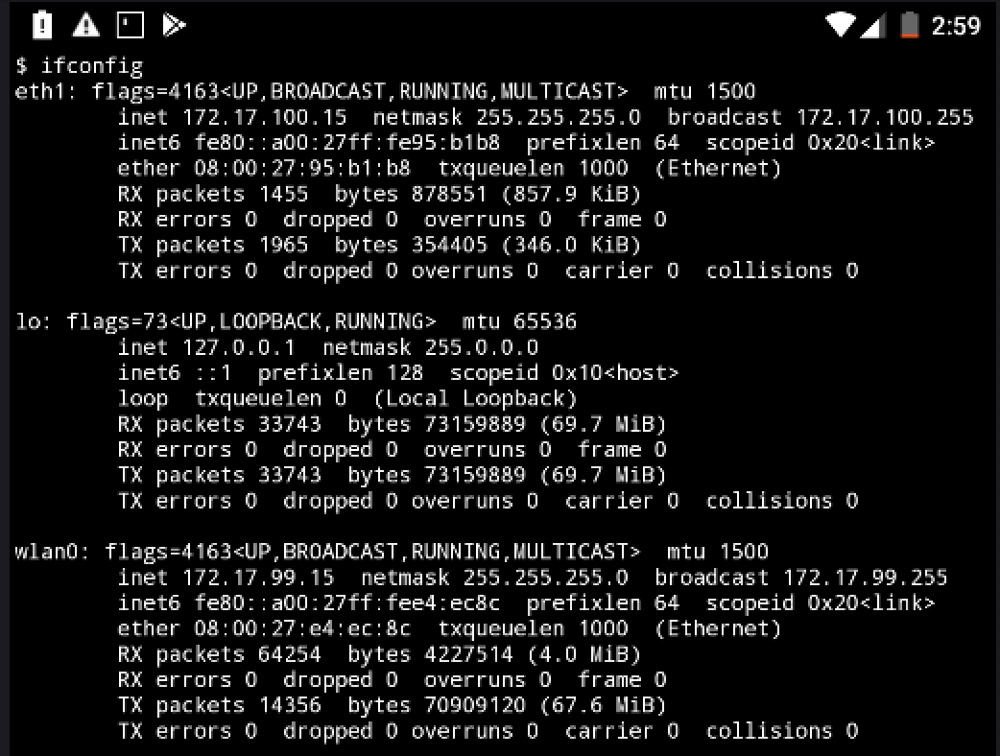

# ad-messaging

## Installation
### Download these apps:
1. Install [Termux](https://play.google.com/store/apps/details?id=com.termux&hl=en_US) from the Android Play Store 
2. Install [AnLinux](https://play.google.com/store/apps/details?id=exa.lnx.a&hl=en_US) from Android Play Store
3. Install [ProxyDroid](https://play.google.com/store/apps/details?id=org.proxydroid&hl=en_US) from Android Play Store

### AnLinux
Click choose then pick Ubuntu (recommended for beginner) 
### Termux
```
$ pkg install wget openssl-tool proot -y && hash -r && wget https://raw.githubusercontent.com/EXALAB/AnLinux-Resources/master/Scripts/Installer/Ubuntu/ubuntu.sh && bash ubuntu.sh
``` 
Install Network Tools
```
$ pkg install net-tools
```
Setup sdcard access
```
$ pkg update && pkg install nano
$ nano start-ubuntu.sh
``` 
and uncomment this line:
```
#command+=" -b /sdcard"
``` 
Then start the VM
```
$ ./start-ubuntu.sh
``` 
Inside the VM install MitmProxy
```apt update
$ apt install python3-pip
$ pip3 install mitmproxy
``` 

## Proxy Configuration
### Termux
Find out device IP address
```
$ ifconfig
```
