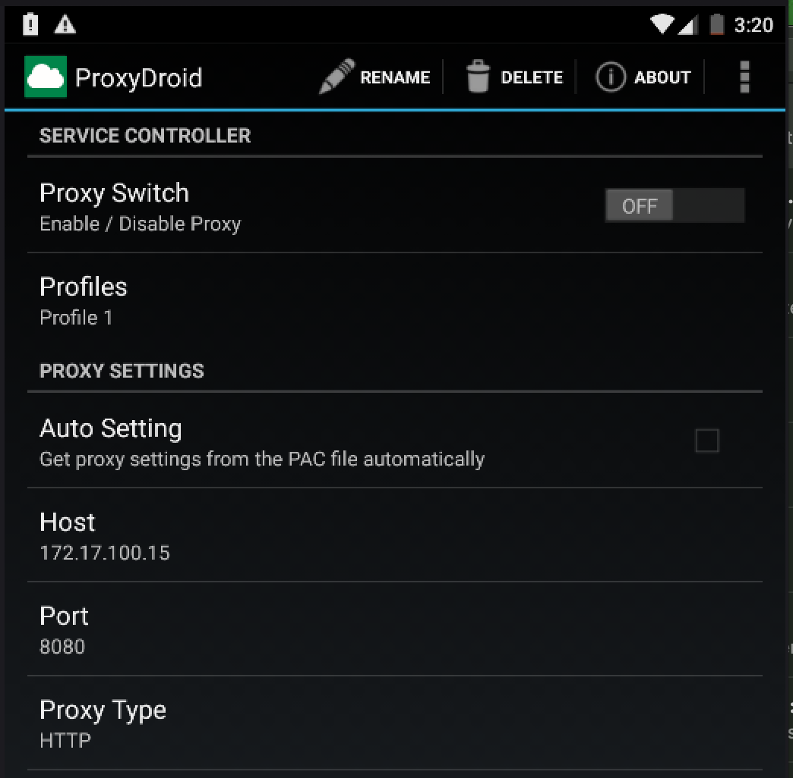

# ad-messaging

## Installation
### Download these apps:
1. Install [Termux](https://play.google.com/store/apps/details?id=com.termux&hl=en_US) from the Android Play Store 
2. Install [AnLinux](https://play.google.com/store/apps/details?id=exa.lnx.a&hl=en_US) from Android Play Store
3. Install [ProxyDroid](https://play.google.com/store/apps/details?id=org.proxydroid&hl=en_US) from Android Play Store

### AnLinux
Click choose then pick Ubuntu (recommended for beginner) 
### Termux
```
$ pkg install wget openssl-tool proot -y && hash -r && wget https://raw.githubusercontent.com/EXALAB/AnLinux-Resources/master/Scripts/Installer/Ubuntu/ubuntu.sh && bash ubuntu.sh
``` 
Install Network Tools
```
$ pkg install net-tools
```
Setup sdcard access
```
$ pkg update && pkg install nano
$ nano start-ubuntu.sh
``` 
and uncomment this line to gain access to sdcard:
```
#command+=" -b /sdcard"
``` 
Then start the VM
```
$ ./start-ubuntu.sh
``` 
Inside the VM install MitmProxy
```apt update
$ apt install python3-pip
$ pip3 install mitmproxy
``` 

## Proxy Configuration
### Termux
Find out device IP address
```
$ ifconfig
```

### Phone Settings
Go to Wi-Fi and long press the network, this will open up network settings. 
On this window choose Modify network.  
Enter the IP address obtained earlier and set the port to be 8080 then click save.

## Phone Browser
Visit mitm.it

Choose Android.  
Give the certificate a name then click Ok.  

## ProxyDroid
Enter the IP address and set the port to 8080

Enable DNS Proxy

Then turn on the Proxy Switch

## Scripting With MitmProxy 
Get the add scraping scripts from the scripts folder in the repository and download them to your phone
```
$ adb push mitmscript.py sdcard
$ adb push dbHelper.py sdcard
```
Open up Termux and start the VM then navigate to the sdcard
```
$ cd ../../sdcard
$ mitmdump -s mitmscript.py
```